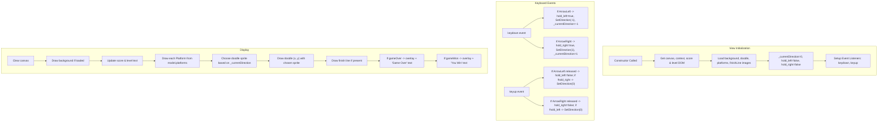

# Doodle Jump
# Flow Charts
## Model chart

```mermaid
flowchart TB
    %% --- SUBGRAPH: Model Construction ---
    subgraph Model Construction
        A1[Constructor Called] --> A2[Initialize hitbox, position, score, level]
        A2 --> A3["Call _generateInitialPlatform"]
        A3 --> A4[Set player position on platform]
        A2 --> A5[Create FinishLine object]
        A2 --> A6[gameOver = false, gameWon = false]
        A2 --> A7["Call _generatePlatforms"]
    end

    %% --- SUBGRAPH: Move(fps) ---
    subgraph Move
        B1[Move Called] --> B2["Update horizontal position (direction * SPEED / fps)"]
        B2 --> B3["Wrap around X if out of bounds"]
        B3 --> B4["Apply gravity (gravitySpeed += GRAVITY)"]
        B4 --> B5["position.y += gravitySpeed / fps"]
        B5 --> B6["Update each Platform with platform.update()"]
        B6 --> B7["Check Platform Collisions"]
        B7 -->|Collision| B8["Handle jump or disappearing logic"]
        B8 --> B9["Set gravitySpeed = -JUMP_FORCE if jumping"]
        B7 -->|No Collision| B10["Continue falling"]
        B5 --> B11["If y < canvas center, scroll world"]
        B11 --> B12["Scroll Platforms and FinishLine"]
        B11 --> B13["Increase score, update level"]
        B13 -->|score < 9700| B14["Generate platforms if needed"]
        B13 -->|score >= 10000| B15["gameWon = true"]
        B5 --> B16["If y > canvas height, gameOver = true"]
        B16 --> B17[End Move]
    end

    %% --- SUBGRAPH: Platform Generation ---
    subgraph Platform Generation
        C1["_generatePlatforms called"] --> C2["Remove off-screen platforms"]
        C2 --> C3["_getTargetPlatformCount"]
        C3 --> C4["While currentPlatforms < targetCount"]
        C4 --> C5["Find highest platform"]
        C5 --> C6["Compute feasible Y range"]
        C6 --> C7["_generatePlatformType(level)"]
        C7 --> C8["Calculate newPlatformY with spacing logic"]
        C8 --> C9["_calculateViableXPosition(newPlatformY)"]
        C9 --> C10["Push new Platform into _platforms array"]
    end
```
## Controller chart

```mermaid
flowchart TB
    subgraph Controller Initialization
        A[Controller Constructor] --> B[Save references to Model & View]
        B --> C["model.BindDisplay(Display)"]
        C --> D["view.BindSetDirection(SetDirection)"]
        D --> E["Initialize timing (startTime, lag, fps)"]
        E --> F["Call Update() to start main loop"]
    end

    subgraph Update Loop
        G[Update] --> H["currentTime, deltaTime = now - startTime"]
        H --> I["lag += deltaTime, startTime = currentTime"]
        I --> J["While lag >= frameDuration"]
        J -->|Inside While| K["Check if !model.gameOver && !model.gameWon"]
        K -->|If still playing| L["model.Move(fps)"]
        L --> M["lag -= frameDuration"]
        J -->|Loop finishes| N["requestAnimationFrame(Update)"]
    end

    subgraph Bound Methods
        X["Display(model)"] --> Y["view.Display(model)"]
        Z["SetDirection(newDir)"] --> W["model.direction = newDir"]
    end
```
## View chart

```mermaid
flowchart TB
    subgraph View Initialization
        A1[Constructor Called] --> A2["Get canvas, context, score & level DOM"]
        A2 --> A3["Load background, doodle, platforms, finishLine images"]
        A3 --> A4["_currentDirection=0, hold_left=false, hold_right=false"]
        A4 --> A5["Setup Event Listeners: keydown, keyup"]
    end

    subgraph Keyboard Events
        B1[keydown event] --> B2["If ArrowLeft -> hold_left=true, SetDirection(-1), _currentDirection=-1"]
        B1 --> B3["If ArrowRight -> hold_right=true, SetDirection(1), _currentDirection=1"]

        B4[keyup event] --> B5["If ArrowLeft released -> hold_left=false; if !hold_right -> SetDirection(0)"]
        B4 --> B6["If ArrowRight released -> hold_right=false; if !hold_left -> SetDirection(0)"]
    end

    subgraph Display
        C1["Clear canvas"] --> C2["Draw background if loaded"]
        C2 --> C3["Update score & level text"]
        C3 --> C4["Draw each Platform from model.platforms"]
        C4 --> C5["Choose doodle sprite based on _currentDirection"]
        C5 --> C6["Draw doodle (x, y) with chosen sprite"]
        C6 --> C7["Draw finish line if present"]
        C7 --> C8["If gameOver -> overlay + 'Game Over' text"]
        C8 --> C9["If gameWon -> overlay + 'You Win' text"]
    end
```

